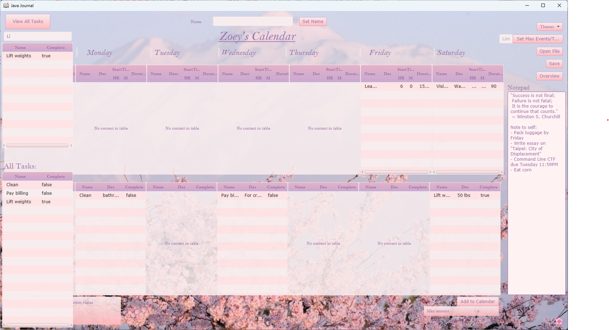
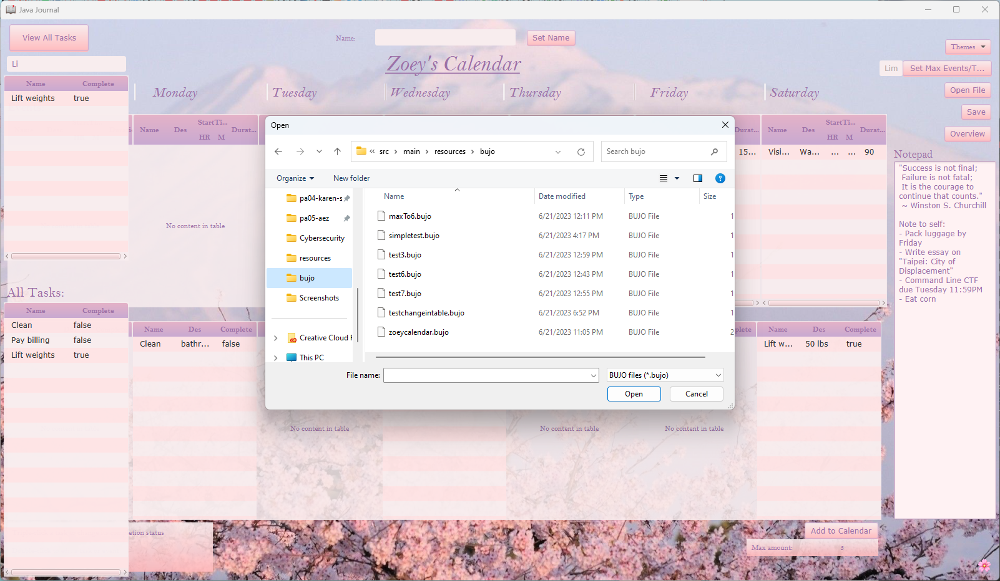
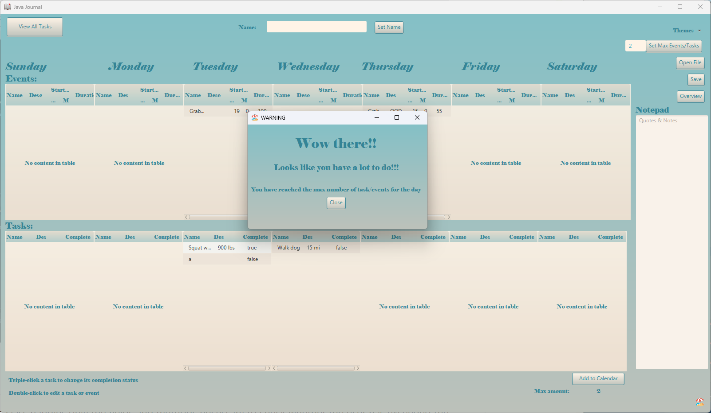
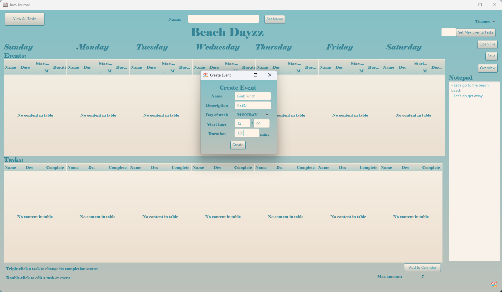
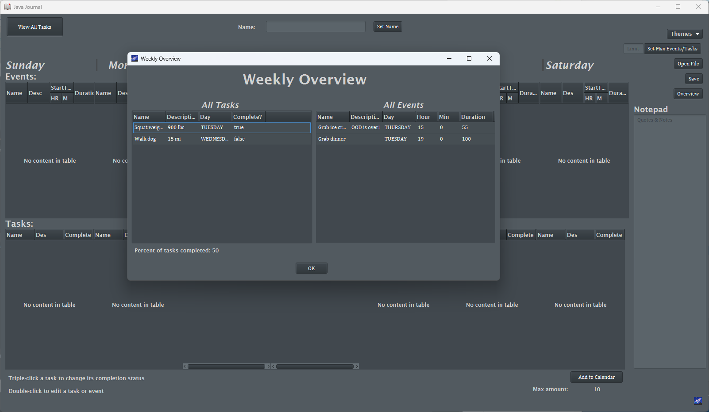
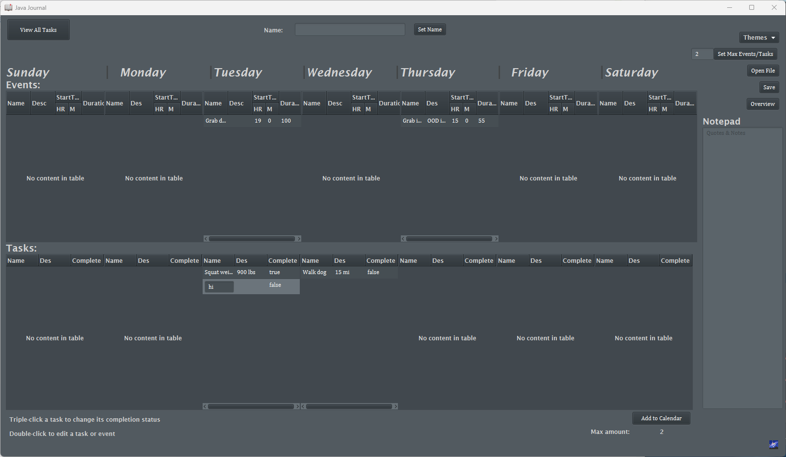

# 3500 PA05 Project Repo

[PA Write Up](https://markefontenot.notion.site/PA-05-8263d28a81a7473d8372c6579abd6481)

# Pitch
Do you struggle with planning out your schedule on a day-to-day basis?
Do you find yourself often forgetting plans you've made further on in the week?
Well, look no further -- Welcome to our online bullet journal!
Our bullet journal contains several helpful features and includes a Quotes & Notes section
where you can quickly jot down any thoughts you have. 
Is the week view too overwhelming for you? No worries! Our bullet journal is equipped with a 
view that only lists your tasks. Better yet, you can even search up specific tasks by their name.
In addition, our weekly overview feature allows you to view all your tasks and events in 
a clean, uncluttered fashion, permitting easy access and organization to all your calendar items.
Tired of the bland, white week view? We've got you covered. We have 3 other themes you can choose 
from that will fulfill your aesthetic needs.
By clicking on the arrows of the table, you can sort all of your tasks and events any order you'd 
like, whether it be by the item's name, duration, or description.
Oops! Accidentally misspelled a word in a task you made? By double-clicking on the value you'd like
to change, you can edit your mistake in real time.
What are you waiting for? Try our bullet journal today!

# Screenshots

# SOLID
S - Our MaxItems class handles only the fields and methods necessary to check whether the user 
    has exceeded the max limit of tasks or events for the day. Therefore, its only responsibility
    is to keep track of the max amount of tasks, checking whether the user has gone over the limit or not.
O - We use an abstract class called CalendarItem to abstract the classes Event and Task. Rather than changing 
    the elements of each class individually, we instead added functionality to our abstract class when 
    dealing with fields shared between the two classes.
L - We created an abstract class that extends the superclass TextField called LimitedTextField for creating text
    fields that only accept certain inputs. LimitedTextField has several subclasses which extend it, such as 
    MilitaryHourTextField and MilitaryMinuteTextField. This way, any instance of TextField is able to be substituted 
    by any of its subclasses at any moment without breaking the application.
I - To separate our model, controller, and view, we used different interfaces to support their specific
    functionalities. We have a controller interface to maintain the run() method between controllers, a view interface
    to maintain the load() method between views, and use an interface called CalendarItem to support actions shared by 
    events and tasks.
D - We used an AbstractCalendarItemController to abstract shared fields and methods between our CreateEventController
    and CreateTaskController. This is an example of the dependency inversion principle as both of those controllers
    are dependent on an abstract class.

# Extending our program
Extending from our program, we could easily add the vertical layout feature to our code. Instead of just having 
one view, we would have an abstract class to abstract a vertical view class and a horizontal view class, as 
their methods and fields would be the same and the FXML objects would have the same fx:id names. The main thing that
would change is that we would implement a new interface for the view, and have two classes, a horizontal view and 
vertical view class, that would implement this interface. These views would have different FXMLs to load, as 
the layout would look different for each view. 

# Image Credits
Calendar icon: https://www.iconarchive.com/show/small-n-flat-icons-by-paomedia/calendar-icon.html
Journal icon: https://www.clipartmax.com/middle/m2i8H7i8b1Z5G6d3_open-book-icon-buch-emoji/
Milky way icon: https://emojiterra.com/milky-way/
Beach icon: https://emojiterra.com/beach-with-umbrella/
Cherry blossom icon: https://emojipedia.org/apple/ios-10.3/cherry-blossom/
Sakura flowers background: https://wallpaperboat.com/aesthetic-flower-wallpapers, background 19